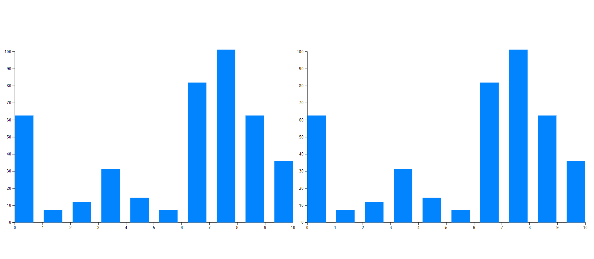

# **```MyDash LLC Internship Assignment```**

### Assignment Information -

1. `Create this page using Reactjs.`
2. `Scss modules for styling.`
3. `Use the BEM method for classnames.`
4. `Validate the Email, password match and phone number with js, show the error message under the input.`
5. `Next page on clicking create account will simply take you to a page where you have to create a bar chart using d3.js and the data for the chart should be randomized on every click.`

---

<br>

### Installation Setup & Running -


1. `git clone -b amware https://github.com/Aabhashzzz1/myDash__d3.git`
2. `cd myDash__d3`
3. `npm i`
4. `npm start`
```bash
Now we all done, to start our server for that we can type above cmd and to verify check your cmd console 
```
6. `localhost:3000`
```bash
Open your favorite browser and paste the above link
```

---

<br>

### ```Sample's -```

<br>


<br >


<br >



---

<br>

### **```Developer's By -```**

> * [Aabhash Malviya](https://github.com/Aabhashzzz1)

<br>

### **Support Me**

<br>
<a href="https://www.buymeacoffee.com/aamware"></a>
